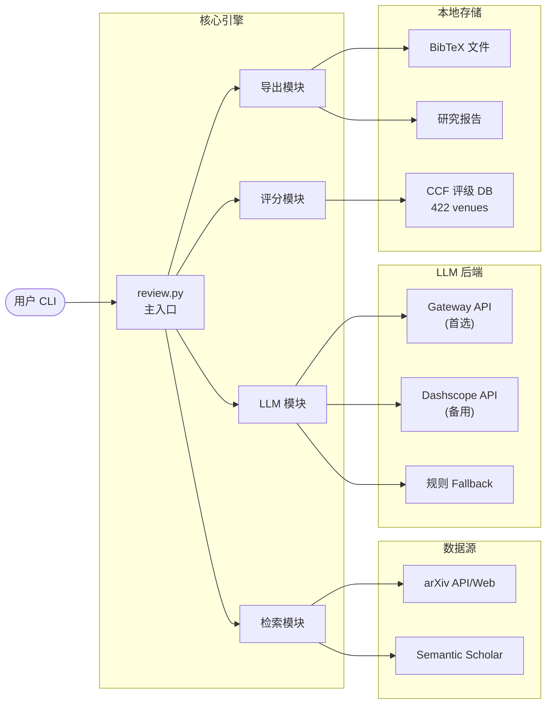

# Paper Review Pro 📚

> **高精度论文检索与检阅系统** — 多源检索 · 智能筛选 · CCF 评级 · AI 摘要 · BibTeX 导出

[](https://clawhub.ai/alfredliang11/paper-review-pro)
[](LICENSE)
[](https://clawhub.ai/alfredliang11/paper-review-pro)

---

## ✨ 特性一览

| 特性               | 说明                                                    |
| ------------------ | ------------------------------------------------------- |
| 🔍 **多源检索**    | 同时检索 arXiv + Semantic Scholar，覆盖预印本与正式发表 |
| 📊 **智能评分**    | 相关度 × 权威度综合评分，精准识别高价值论文             |
| 🏆 **CCF 评级**    | 内置 422 个 CCF 推荐 venue，自动标注 A/B/C 类           |
| 🤖 **AI 摘要**     | LLM 自动提取研究问题、方法、结论、创新点四要素          |
| 🌐 **领域扩展**    | 基于 Top-K 论文生成扩展检索词，发现子领域与交叉方向     |
| 📑 **BibTeX 导出** | 自动生成标准 BibTeX，一键导入 Zotero/Mendeley/EndNote   |
| 📋 **完整报告**    | 自动生成研究领域分析报告，含统计数据与趋势分析          |
| 🛡️ **高健壮性**    | 多层错误回退 + Timeout 保护，极端情况不中断             |

---

## 🏗️ 系统架构

### 高层架构


---

## 🚀 快速开始

### 安装

```bash
openclaw skills install paper-review-pro
```

### 使用

```bash
cd ~/.openclaw/workspace/skills/paper-review-pro
python scripts/review.py --query "LLM reasoning" --retrieve_number 20 --keep_topk 5 --year 2024
```

### 输出

| 输出项         | 格式     | 位置                                    |
| -------------- | -------- | --------------------------------------- |
| Top-K 论文列表 | 排序列表 | 终端直接输出                            |
| 扩展检索结果   | 补充列表 | 终端输出                                |
| BibTeX 文件    | `.bib`   | `~/.openclaw/paper-review-pro/papers/`  |
| 研究报告       | Markdown | `~/.openclaw/paper-review-pro/reports/` |

---

## 📦 功能详解

### 1. 多源检索与去重

- **arXiv** — 预印本为主，覆盖最新研究
- **Semantic Scholar** — 正式发表为主，含引用信息
- **去重机制** — 基于标题和 DOI 本地去重

### 2. 综合评分系统

```
Score = Relevance × (1 - weight) + Authority × weight
```

| 等级                                  | 权威度分值 |
| ------------------------------------- | ---------- |
| CCF-A （NeurIPS, ICML, CVPR, ACL...） | 1.0        |
| CCF-B                                 | 0.8        |
| CCF-C                                 | 0.6        |
| 已发表未评级                          | 0.5        |
| Preprint                              | 0.3        |

### 3. CCF 评级查询

覆盖 **422 个 venue**（会议 275 / 期刊 147），含全部 CCF 推荐目录。

### 4. AI 结构化摘要

LLM 自动提取：**研究问题 → 方法 → 结论 → 创新点**

### 5. 领域扩展

基于 Top-K 论文内容分析，自动生成语义扩展词，发现子领域、替代方案和交叉应用。

### 6. BibTeX 导出

自动生成标准 BibTeX → 导入 Zotero：`文件 → 导入 → 从文件导入`

---

## ⚙️ 配置

```bash
python scripts/config.py --default_n 20 --default_k 3 --min_year 2024 --authority-weight 0.3
```

| 参数                 | 默认 | 说明                 |
| -------------------- | ---- | -------------------- |
| `--query`            | —    | 检索关键词（必需）   |
| `--retrieve_number`  | 10   | 初始检索数量         |
| `--keep_topk`        | 3    | 保留核心论文数       |
| `--year`             | 2025 | 截止年份             |
| `--no-llm`           | 启用 | 禁用 LLM 摘要        |
| `--no-authority`     | 启用 | 禁用权威度评分       |
| `--authority-weight` | 0.3  | 权威度权重 (0.0-1.0) |
| `--use-api`          | 禁用 | 在线查询发表状态     |

---

## 运行环境

### 环境要求

| 依赖             | 版本要求 | 说明                      |
| ---------------- | -------- | ------------------------- |
| Python           | ≥ 3.10   | 核心运行环境              |
| `requests`       | ≥ 2.28   | HTTP 请求                 |
| `beautifulsoup4` | ≥ 4.12   | HTML 解析（网页爬取回退） |
| `lxml`           | ≥ 4.9    | XML/HTML 解析加速         |

### 部署方式

#### 方式一：OpenClaw 安装（推荐）

```bash
# 一键安装
openclaw skills install paper-review-pro

# 运行检索
cd ~/.openclaw/workspace/skills/paper-review-pro
python scripts/review.py --query "your query"
```

#### 方式二：手动部署

```bash
# 1. 克隆仓库
git clone https://github.com/bpluo/Paper-Review-Pro.git
cd Paper-Review-Pro

# 2. 创建虚拟环境（推荐）
python -m venv .venv
# Windows
.venv\Scripts\activate
# macOS/Linux
source .venv/bin/activate

# 3. 安装依赖
pip install requests beautifulsoup4 lxml

# 4. 运行
python scripts/review.py --query "your query"
```

### LLM 配置（可选）

如需 AI 摘要和扩展检索功能，需要配置 LLM 后端。

**方式 A：OpenClaw Gateway（推荐）**

```bash
# gateway_url 默认指向 http://localhost:14940
# 确保 Gateway 服务已启动
```

**方式 B：Dashscope（阿里云通义千问）**

```json
{
  "llm": {
    "provider": "dashscope",
    "api_key": "sk-xxxx",
    "model": "qwen-plus"
  }
}
```

> 💡 未配置 LLM 时，系统自动降级为规则 Fallback，核心检索功能不受影响。

---

##�🛡️ 错误处理

| 层级     | 回退链                                |
| -------- | ------------------------------------- |
| arXiv    | `API → 网页爬取 → 跳过 arXiv`         |
| LLM      | `Gateway → Dashscope → 规则 Fallback` |
| 发表状态 | `在线 API → 本地数据库 → 未评级`      |
| 卡死保护 | TimeoutMonitor，20 分钟超时自动终止   |
| 网络重试 | 3 次尝试，指数退避 (1s → 2s → 4s)     |

---

##  项目结构

```
paper-review-pro/
├── scripts/
│   ├── review.py                  # 🔧 主入口 — 参数解析 + 流程编排
│   ├── config.py                  # ⚙️ 配置管理 CLI
│   ├── test_publication_status.py # 🧪 CCF 评级测试套件
│   └── core/
│       ├── __init__.py
│       ├── arxiv.py               # 📡 arXiv 检索（API + 网页回退）
│       ├── semantic_scholar.py    # 📡 Semantic Scholar 检索
│       ├── publication_status.py  # 🏆 CCF 评级数据库（422 venues）
│       ├── scoring.py             # 📊 综合评分系统
│       ├── llm_integration.py     # 🤖 LLM 集成（Gateway/Dashscope/Fallback）
│       ├── bibtex.py              # 📑 BibTeX 导出
│       ├── report_generator.py    # 📋 研究报告生成
│       └── utils.py               # 🛠️ 工具函数（TimeoutMonitor 等）
├── reference/                     # 📖 详细模块文档
│   ├── LLM_INTEGRATION.md
│   ├── BIBTEX_EXPORT.md
│   ├── PUBLICATION_STATUS.md
│   ├── SCORING_SYSTEM.md
│   └── BUGFIXES.md
├── config.json                    # 默认配置文件
├── SKILL.md                       # OpenClaw 技能元数据
├── CHANGELOG.md                   # 更新日志
└── LICENSE                        # MIT-0
```

---

##  参考文档

| 文档                              | 说明                           |
| --------------------------------- | ------------------------------ |
| `reference/LLM_INTEGRATION.md`    | LLM 集成（摘要生成、查询扩展） |
| `reference/BIBTEX_EXPORT.md`      | BibTeX 导出模块                |
| `reference/PUBLICATION_STATUS.md` | 发表状态与 CCF 评级            |
| `reference/SCORING_SYSTEM.md`     | 综合评分系统                   |
| `reference/BUGFIXES.md`           | 重要修复记录                   |

---

## 📝 更新日志

详见 [`CHANGELOG.md`](CHANGELOG.md)。

---

**版本**: v1.0.0 · **许可**: MIT-0 · **维护**: [alfredliang11](https://clawhub.ai/user/alfredliang11) · [ClawHub](https://clawhub.ai/alfredliang11/paper-review-pro)
