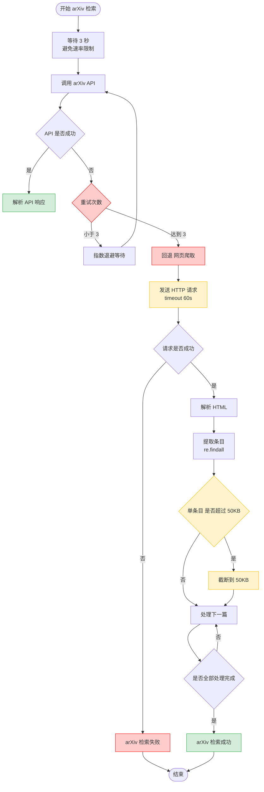
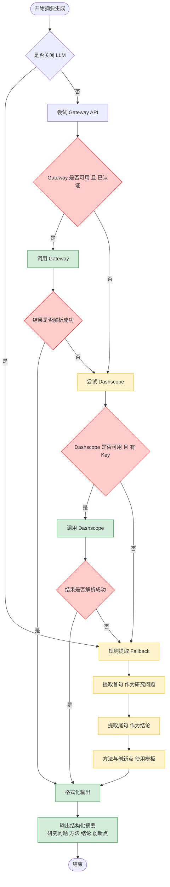
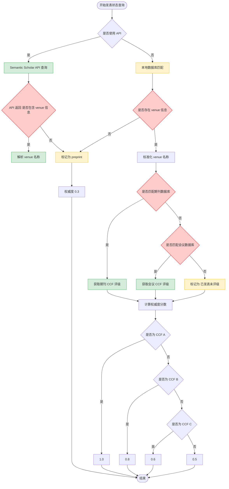
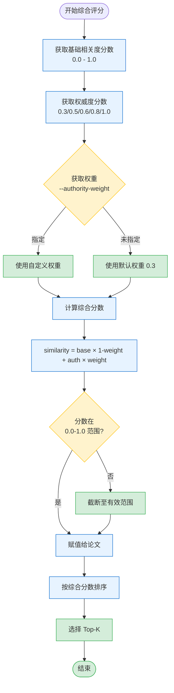
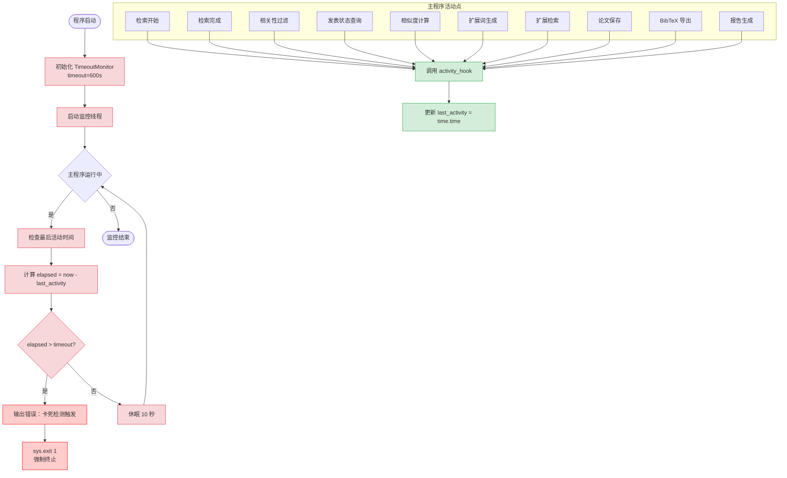
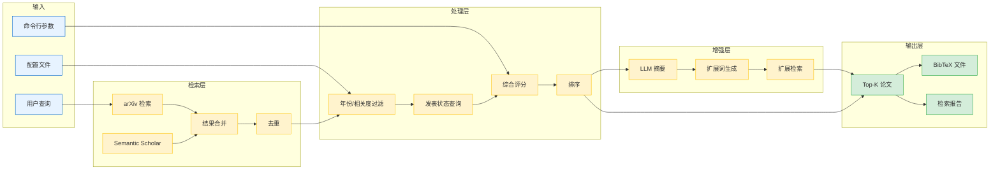

# Paper Review Pro - 执行流程图

本文档描述 Paper Review Pro 技能从启动到完成的完整执行流程，包括所有错误处理和回退机制。

---

## 📊 整体执行流程

```mermaid
flowchart TD
    Start([开始]) --> Init[初始化配置与参数]
    Init --> Monitor["启动 TimeoutMonitor\n卡死检测保护"]
    Monitor --> Search1["arXiv 检索"]

    %% arXiv 流程
    Search1 --> API_Try1["[arXiv] API 尝试 1/3"]
    API_Try1 -->|成功| API_Success["[arXiv] 获取结果"]
    API_Try1 -->|失败| API_Retry1{"[arXiv] 重试次数 小于 3"}
    API_Retry1 -->|是| API_Try1
    API_Retry1 -->|否| Web_Fallback["[arXiv] 网页爬取"]

    Web_Fallback --> Web_Success{"[arXiv] 爬取成功 timeout 60s"}
    Web_Success -->|是| API_Success
    Web_Success -->|否| Skip_arXiv["跳过 arXiv"]

    %% Semantic Scholar
    API_Success --> Search2["Semantic Scholar 检索"]
    Skip_arXiv --> Search2

    Search2 --> SS_Try1["[SS] API 尝试 1/3"]
    SS_Try1 -->|成功| SS_Success["[SS] 获取结果"]
    SS_Try1 -->|失败| SS_Retry{"[SS] 重试次数 小于 3"}
    SS_Retry -->|是| SS_Try1
    SS_Retry -->|否| SS_Fail["仅使用 arXiv"]

    %% 合并
    SS_Success --> Merge["合并结果"]
    SS_Fail --> Merge

    Merge --> Dedup["去重 标题 DOI"]
    Dedup --> YearFilter["年份过滤"]
    YearFilter --> SimFilter["相关度筛选"]
    SimFilter --> TopK["TopK 筛选"]

    %% 状态查询
    TopK --> Status_Query["查询发表状态"]

    Status_Query --> UseAPI{"使用 API 且可用"}
    UseAPI -->|是| OnlineAPI["在线查询"]
    UseAPI -->|否| LocalDB["本地匹配"]

    OnlineAPI --> Status_Result["获取状态"]
    LocalDB --> Status_Result
    Status_Result --> AuthScore["计算权威度"]

    %% 打分
    AuthScore --> FinalScore["综合分数计算"]
    FinalScore --> ReRank["重新排序"]

    %% LLM
    ReRank --> LLM_Check{"是否启用 LLM"}
    LLM_Check -->|是| Summarize["生成摘要"]
    LLM_Check -->|否| Fallback_Sum["规则摘要"]

    %% LLM 细节
    Summarize --> Gateway{"Gateway 可用"}
    Gateway -->|是| Gateway_Call["调用 Gateway"]
    Gateway -->|否| Dashscope{"Dashscope 可用"}

    Dashscope -->|是| DS_Call["调用 Dashscope"]
    Dashscope -->|否| Rule_Fallback["规则提取"]

    Gateway_Call --> Sum_Result["结构化摘要"]
    DS_Call --> Sum_Result
    Rule_Fallback --> Sum_Result
    Fallback_Sum --> Sum_Result

    %% 扩展检索
    Sum_Result --> Expand{"需要扩展检索"}
    Expand -->|是| GenExpand["生成扩展词"]
    Expand -->|否| SavePapers["保存论文"]

    GenExpand --> Expand_LLM{"LLM 可用"}
    Expand_LLM -->|是| LLM_Expand["LLM 生成"]
    Expand_LLM -->|否| Rule_Expand["规则生成"]

    LLM_Expand --> Expand_Words["扩展词"]
    Rule_Expand --> Expand_Words

    Expand_Words --> Expand_Search["扩展检索"]
    Expand_Search --> SaveExpand["保存扩展结果"]
    SaveExpand --> SavePapers

    %% 输出
    SavePapers --> Bibtex{"生成 Bibtex"}
    Bibtex -->|否| GenBibtex["生成 Bibtex 文件"]
    Bibtex -->|是| SkipBibtex["跳过"]

    GenBibtex --> Report["生成报告"]
    SkipBibtex --> Report

    Report --> Complete([完成])

    %% 颜色（保留）
    classDef error fill:#ffcccc,stroke:#ff0000
    classDef fallback fill:#fff3cd,stroke:#ffc107
    classDef success fill:#d4edda,stroke:#28a745

    class API_Retry1,SS_Retry,Web_Fallback error
    class Fallback_Sum,Rule_Fallback,Rule_Expand,LocalDB fallback
    class API_Success,SS_Success,Web_Success,Sum_Result success
```

---

## 🔍 关键模块详细流程

### 1. arXiv 检索流程

---

### 2. LLM 摘要生成流程

---

### 3. 发表状态与 CCF 评级流程

---

### 4. 综合评分计算流程

---

### 5. TimeoutMonitor 监控流程

---

## 📋 错误处理汇总表

| 模块 | 主要错误 | 回退策略 | 最终保障 |
|------|---------|---------|---------|
| **arXiv 检索** | API 失败/速率限制 | 网页爬取 | 跳过 arXiv，仅用 Semantic Scholar |
| **Semantic Scholar** | API 失败 | 重试 3 次 | 仅使用 arXiv 结果 |
| **LLM 摘要** | Gateway 401/网络错误 | Dashscope → 规则 Fallback | 规则提取保证输出 |
| **扩展词生成** | LLM 不可用 | 规则提取 | 名词短语 + 学术模式 |
| **发表状态查询** | 在线 API 失败 | 本地数据库 | 标记"未评级" |
| **CCF 匹配** | 无匹配 venue | - | 标记"已发表未评级" |
| **网络请求** | 连接超时 | 指数退避重试 3 次 | 跳过该请求 |
| **程序卡死** | 600 秒无输出 | TimeoutMonitor 检测 | 自动终止并输出错误 |

---

## 🔄 数据流向图

---

## 📝 流程图说明

### 图例说明

| 颜色/样式 | 含义 |
|----------|------|
| 🟩 绿色 | 成功路径/正常流程 |
| 🟨 黄色 | 回退路径/Fallback |
| 🟥 红色 | 错误路径/失败处理 |
| 🔵 蓝色 | 输入数据 |
| 🟡 橙色 | 处理步骤 |
| 🟢 绿色 | 输出结果 |

### 决策点说明

- **菱形框** - 决策点，根据条件选择不同路径
- **矩形框** - 处理步骤
- **圆角矩形** - 开始/结束
- **平行四边形** - 输入/输出

### 监控点说明

TimeoutMonitor 在以下关键节点调用 `activity_hook()`：

1. 检索开始/结束
2. arXiv 检索（API/网页）
3. Semantic Scholar 检索
4. 相关性过滤完成
5. 发表状态查询完成
6. 相似度计算完成
7. 扩展词生成完成
8. 每个扩展检索完成
9. 论文保存完成（Top-K + 扩展）
10. BibTeX 导出完成
11. 报告生成完成

---

**文档版本**: 2026-03-30  
**适用版本**: Paper Review Pro v2026.03.29
